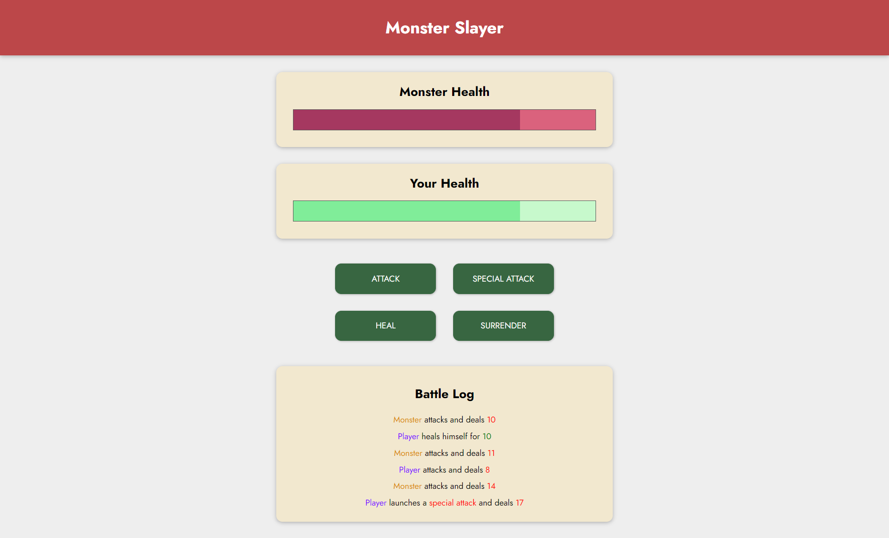

# The Monster Slayer Game - Udemy Vue Course

## Description

This repository contains the project "The Monster Slayer Game" developed as part of the [Vue - The Complete Guide (incl. Router & Composition API)](https://www.udemy.com/course/vuejs-2-the-complete-guide/) course on Udemy. The Monster Slayer Game is a simple web-based game where the player battles a monster. The goal of the game is to defeat the monster by attacking, using special attacks, or healing, while ensuring the monster does not defeat the player.

## Features

- Player vs. Monster Battle: The player can attack the monster to decrease its health points (HP).
- Special Attacks: The player can perform special attacks on the monster, causing more damage.
- Heal: The player can heal themselves to restore lost health points.
- Log: A log keeps track of all actions performed during the game.
- Game Over: The game ends when either the player or the monster loses all their HP.

## Technologies Used

- HTML5 and CSS3 for the user interface.
- Vue.js for the application's logic and dynamic data binding.
- The project was developed following modern Vue.js practices, including the Composition API.

## Getting Started

To play the Monster Slayer Game, simply clone this repository to your local machine and open the `index.html` file in your web browser.

## Project Structure

The project follows a simple structure:

- `index.html`: The main HTML file for the project.
- `style.css`: The CSS file for styling the user interface.
- `app.js`: The main JavaScript file containing the Vue.js application.

## Credits

The Monster Slayer Game was created as part of the [Vue - The Complete Guide (incl. Router & Composition API)](https://www.udemy.com/course/vuejs-2-the-complete-guide/) course on Udemy, instructed by [Maximilian Schwarzmüller](https://www.udemy.com/user/maximilian-schwarzmuller/). The design, code, and concepts are based on the course content.
